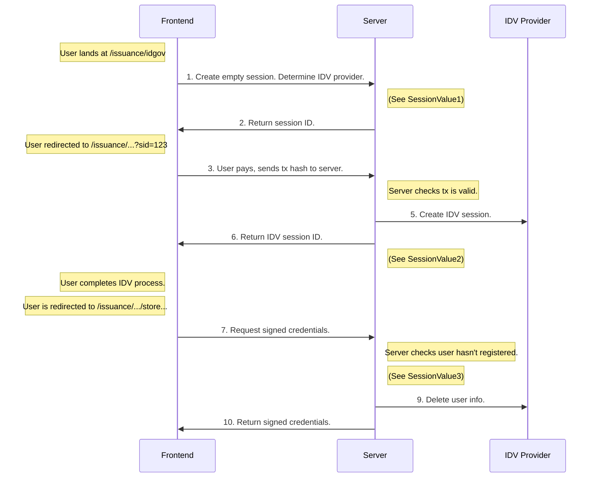

# Verification Sequence

The following is a (somewhat simplified) sequence diagram of the ID verification flow.

The core data structure in this flow is the "session". You can see the snapshots of an example session in SessionValue1, SessionValue2, and SessionValue3 to see how it changes through the verification flow.




```javascript
SessionValue1 = {
    id: "123",
    idvProvider: "veriff",
    status: "NEEDS_PAYMENT"
}

SessionValue2 = {
    id: "123",
    idvProvider: "veriff",
    status: "IN_PROGRESS", // changed
    idvSessionId: "456", // added
    txHash: "0x123", // added
    chainId: 1 // added
}

SessionValue3 = {
    id: "123",
    idvProvider: "veriff",
    status: "ISSUED", // changed
    idvSessionId: "456",
    txHash: "0x123",
    chainId: 1
}
```

Note on nomencalture: "Session" refers to the data structure maintained by Holonym's server. "IDV session" refers to the data structure maintained by the IDV provider.
